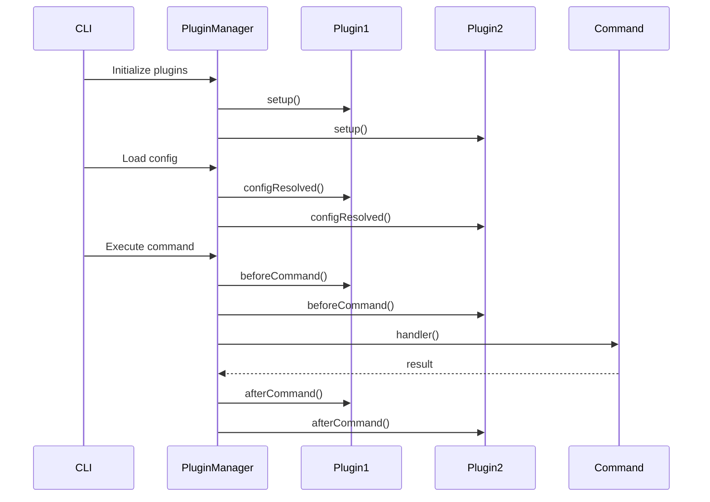
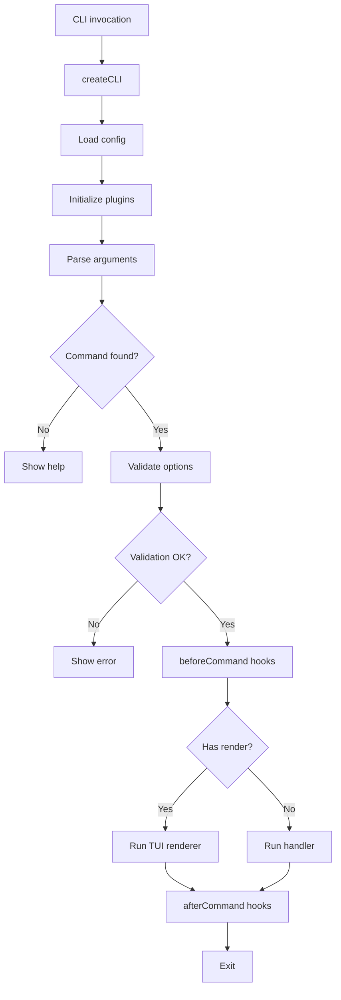

Bunli is designed as a modular monorepo where each package has a focused responsibility. This architecture makes it easy to use only what you need while providing a cohesive development experience.

## Monorepo structure

Bunli uses Bun workspaces to manage multiple packages:

```
bunli/
├── packages/
│   ├── core/              # Framework core
│   ├── cli/               # Development toolchain
│   ├── tui/               # Terminal UI components
│   ├── runtime/           # Prompt and renderer runtime
│   ├── utils/             # Utilities (colors, validation)
│   ├── test/              # Testing utilities
│   ├── generator/         # Type generation
│   ├── create-bunli/      # Project scaffolding
│   ├── plugin-ai-detect/  # AI detection plugin
│   ├── plugin-completions/# Shell completions
│   ├── plugin-config/     # Config file loading
│   └── plugin-mcp/        # MCP integration
├── examples/              # Working examples
└── apps/
    └── web/               # Documentation site
```

### Core packages

#### @bunli/core

The heart of Bunli, providing:

- **Command definitions** via `defineCommand` and `defineGroup`
- **Option schemas** with `option()` helper
- **CLI creation** through `createCLI()`
- **Plugin system** with `PluginManager`
- **Argument parsing** using standard CLI conventions
- **Config loading** from `bunli.config.ts`

**Key files:**
- `src/types.ts` - Core type definitions
- `src/cli.ts` - CLI class implementation
- `src/parser.ts` - Argument parsing
- `src/config.ts` - Configuration schema
- `src/plugin/` - Plugin system

#### @bunli/tui

Terminal UI components built on OpenTUI:

- **Components** - ProgressBar, Select, Table, Charts
- **Hooks** - useKeyboard, useRenderer, useTerminalDimensions
- **Styling** - Colors, text attributes, theming

#### @bunli/runtime

Prompt and renderer runtime infrastructure:

- **Prompt API** - `prompt()` for interactive input
- **Spinner factory** - `spinner()` for loading states
- **Event handling** - Keyboard and signal management
- **Transport layer** - Renderer communication

#### @bunli/utils

Shared utilities:

- **Colors** - Terminal color utilities
- **Validation** - Schema validation helpers

### CLI toolchain

#### bunli

Development CLI with commands:

- `bunli dev` - Hot-reload development mode
- `bunli build` - Build and optionally compile to binary
- `bunli test` - Run tests with coverage
- `bunli generate` - Generate TypeScript types
- `bunli completions` - Generate shell completions

**Location:** `packages/cli/src/commands/`

#### create-bunli

Scaffolding tool for new projects:

```bash
bunx create-bunli my-cli
```

Provides templates:
- **basic** - Minimal CLI setup
- **advanced** - CLI with plugins and TUI
- **monorepo** - Multi-package CLI project

**Location:** `packages/create-bunli/templates/`

#### @bunli/generator

Generates TypeScript type definitions from command files:

```typescript
// Generated in .bunli/commands.gen.ts
declare module '@bunli/core' {
  interface RegisteredCommands {
    'greet': typeof greetCommand
    'deploy': typeof deployCommand
  }
}
```

Enables type-safe programmatic command execution:

```typescript
// TypeScript knows available commands and their options
await cli.execute('greet', { name: 'Alice', loud: true })
```

## Plugin architecture

Plugins extend Bunli's functionality through lifecycle hooks and typed stores.

### Plugin structure

```typescript
import { createPlugin } from '@bunli/core/plugin'
import type { BunliPlugin } from '@bunli/core/plugin'

interface MyPluginStore {
  config: Record<string, unknown>
  initialized: boolean
}

const myPlugin = createPlugin<MyPluginStore>({
  name: 'my-plugin',
  version: '1.0.0',
  
  // Initial store state
  store: {
    config: {},
    initialized: false
  },
  
  // Lifecycle hooks
  async setup(context) {
    // Called during CLI initialization
    console.log('Plugin setup')
  },
  
  async configResolved(config) {
    // Called after config is loaded and merged
    context.store.config = config.plugins?.myPlugin ?? {}
  },
  
  async beforeCommand(context) {
    // Called before each command runs
    context.store.initialized = true
  },
  
  async afterCommand(context) {
    // Called after command completes
    console.log('Command completed')
  }
})
```

### Plugin lifecycle



### Plugin store access

Commands access plugin stores through the context:

```typescript
handler: async ({ context, flags }) => {
  // Access plugin stores (type-safe with proper plugin types)
  const metrics = context?.store.metrics
  const config = context?.store.config
  
  // Use plugin data
  console.log(`Command #${metrics.commandCount}`)
}
```

### Built-in plugins

**@bunli/plugin-ai-detect**

Detects AI coding assistants from environment variables:

```typescript
import { aiAgentPlugin } from '@bunli/plugin-ai-detect'

plugins: [
  aiAgentPlugin({ verbose: true })
]
```

Detects: Claude Code, Cursor, Codex, Amp, Gemini CLI, OpenCode

**@bunli/plugin-completions**

Generates shell completion scripts:

```typescript
import { completionsPlugin } from '@bunli/plugin-completions'

plugins: [
  completionsPlugin({ shell: 'zsh' })
]
```

**@bunli/plugin-config**

Loads configuration from multiple sources:

```typescript
import { configMergerPlugin } from '@bunli/plugin-config'

plugins: [
  configMergerPlugin({
    sources: ['./config.json'],
    mergeStrategy: 'deep'
  })
]
```

**@bunli/plugin-mcp**

Model Context Protocol integration for agentic workflows.

## Command execution flow

Here's how a command flows through Bunli from invocation to completion:



### Step-by-step breakdown

**1. CLI creation**

```typescript
const cli = await createCLI({
  name: 'my-cli',
  version: '1.0.0',
  plugins: [myPlugin]
})
```

**Location:** `packages/core/src/cli.ts`

**2. Command registration**

```typescript
cli.command(greetCommand)
cli.command(deployCommand)
```

Commands are stored in an internal registry for lookup.

**3. Argument parsing**

```typescript
await cli.run() // Uses process.argv
// OR
await cli.run(['greet', '--name', 'Alice'])
```

**Location:** `packages/core/src/parser.ts`

Parsing follows POSIX conventions:
- Short flags: `-n Alice` or `-nAlice`
- Long flags: `--name Alice` or `--name=Alice`
- Boolean flags: `--loud` or `--no-loud`
- Positional arguments: `command arg1 arg2`

**4. Command lookup**

Finds command by name, supporting nested command groups:

```bash
my-cli deploy staging --force
#      └── command
#             └── subcommand
```

**5. Option validation**

Zod schemas validate and transform options:

```typescript
options: {
  port: option(
    z.coerce.number().int().positive().default(3000),
    { description: 'Server port' }
  )
}
```

Invalid values throw `OptionValidationError` with context.

**Location:** `packages/core/src/validation.ts`

**6. Plugin hooks**

```typescript
// Before command
await pluginManager.runBeforeCommand(context)

// Run command
await command.handler({ flags, context, ... })

// After command
await pluginManager.runAfterCommand(context)
```

**Location:** `packages/core/src/plugin/manager.ts`

**7. Command execution**

Commands receive a rich context object:

```typescript
handler: async ({
  flags,        // Validated, typed options
  positional,   // Positional arguments
  shell,        // Bun Shell ($)
  env,          // process.env
  cwd,          // Current directory
  prompt,       // Interactive prompts
  spinner,      // Loading spinners
  colors,       // Terminal colors
  context,      // Plugin stores
  terminal,     // Terminal info (width, height, etc)
  runtime,      // Runtime info (startTime, args, etc)
  signal        // AbortSignal for cancellation
}) => {
  // Command logic
}
```

**Location:** `packages/core/src/types.ts` (HandlerArgs)

## Type generation

Bunli generates TypeScript definitions from your commands for type-safe programmatic execution.

### Generated types

```typescript
// .bunli/commands.gen.ts (auto-generated)
import type { Command } from '@bunli/core'
import type greetCommand from '../commands/greet.js'
import type deployCommand from '../commands/deploy.js'

interface CommandsByName {
  'greet': typeof greetCommand
  'deploy': typeof deployCommand
}

declare module '@bunli/core' {
  interface RegisteredCommands extends CommandsByName {}
}
```

### Type-safe execution

```typescript
// TypeScript knows 'greet' command exists
await cli.execute('greet', {
  name: 'Alice',  // string (required)
  loud: true      // boolean (optional)
})

// Error: Command 'unknown' doesn't exist
await cli.execute('unknown', {})

// Error: Invalid options
await cli.execute('greet', {
  name: 123  // Error: Expected string
})
```

## Configuration system

Bunli loads configuration from `bunli.config.ts` in your project root:

```typescript
import { defineConfig } from '@bunli/core'
import { aiAgentPlugin } from '@bunli/plugin-ai-detect'

export default defineConfig({
  name: 'my-cli',
  version: '1.0.0',
  description: 'My awesome CLI',
  
  plugins: [
    aiAgentPlugin({ verbose: true })
  ],
  
  commands: {
    entry: './cli.ts',
    directory: './commands'
  },
  
  build: {
    entry: './cli.ts',
    outdir: './dist',
    targets: ['bun-linux-x64'],
    minify: true
  },
  
  tui: {
    renderer: {
      bufferMode: 'alternate'
    }
  }
})
```

**Location:** `packages/core/src/config.ts`

## Error handling

Bunli uses `better-result` for type-safe error handling:

```typescript
import { Result, TaggedError } from '@bunli/core'

export class DeploymentError extends TaggedError('DeploymentError')<{
  message: string
  environment: string
  cause?: unknown
}>() {}

handler: async ({ flags }) => {
  const result = await deployApp(flags.environment)
  
  if (result.isErr()) {
    throw new DeploymentError({
      message: 'Deployment failed',
      environment: flags.environment,
      cause: result.error
    })
  }
}
```

**Built-in errors:**
- `InvalidConfigError` - Configuration validation failed
- `CommandNotFoundError` - Command doesn't exist
- `CommandExecutionError` - Command handler threw
- `OptionValidationError` - Option validation failed
- `PluginLoadError` - Plugin failed to load
- `PluginHookError` - Plugin hook threw error

**Location:** `packages/core/src/plugin/errors.ts`

## Next steps

<CardGroup cols={2}>
  <Card title="Commands" icon="terminal" href="/concepts/commands">
    Learn how to define commands
  </Card>
  
  <Card title="Options" icon="sliders" href="/concepts/options">
    Work with command options
  </Card>
  
  <Card title="Plugins" icon="puzzle-piece" href="/plugins">
    Create your own plugins
  </Card>
  
  <Card title="TUI Components" icon="sparkles" href="/tui">
    Build interactive UIs
  </Card>
</CardGroup>
