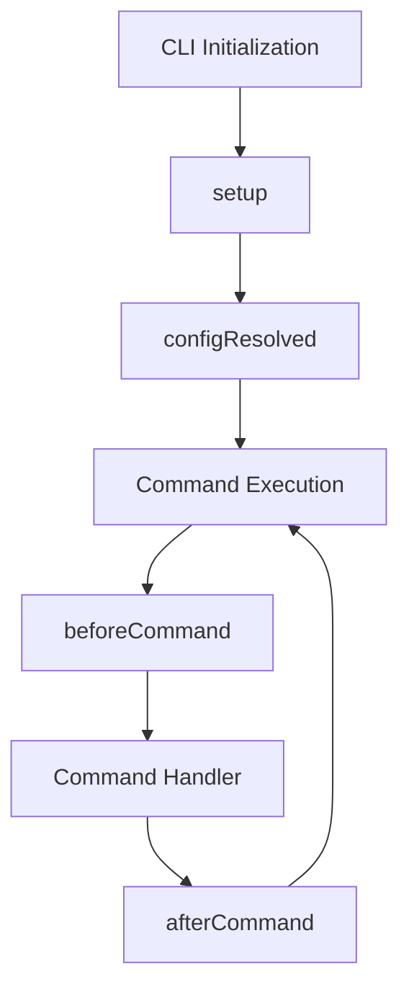

## Hook Lifecycle

Bunli's plugin system provides four lifecycle hooks that execute in a specific order:



## Setup Hook

Called once during CLI initialization. This is where you:
- Modify configuration
- Register commands
- Add middleware
- Initialize plugin state

### Signature

```typescript
setup?(context: PluginContext): void | Promise<void>
```

### Context

```typescript
interface PluginContext {
  /** Current configuration (being built) */
  readonly config: BunliConfigInput
  
  /** Update configuration */
  updateConfig(partial: Partial<BunliConfigInput>): void
  
  /** Register a new command */
  registerCommand(command: Command): void
  
  /** Add global middleware */
  use(middleware: Middleware): void
  
  /** Shared storage between plugins */
  readonly store: Map<string, unknown>
  
  /** Plugin logger */
  readonly logger: Logger
  
  /** System paths */
  readonly paths: PathInfo
}
```

### Example: Dynamic Command Registration

```typescript
const plugin = createPlugin({
  name: 'dynamic-commands',
  
  async setup(context) {
    // Load commands from external source
    const commands = await loadCommandsFromAPI()
    
    for (const cmd of commands) {
      context.registerCommand({
        name: cmd.name,
        description: cmd.description,
        handler: async () => {
          console.log(`Executing ${cmd.name}`)
        }
      })
    }
    
    context.logger.info(`Registered ${commands.length} commands`)
  }
})
```

### Example: Configuration Modification

```typescript
const plugin = createPlugin({
  name: 'config-enhancer',
  
  setup(context) {
    // Add defaults
    context.updateConfig({
      description: context.config.description || 'A Bunli CLI'
    })
    
    // Add environment-specific config
    if (process.env.NODE_ENV === 'production') {
      context.updateConfig({
        dev: { watch: false }
      })
    }
  }
})
```

### Example: Middleware Registration

```typescript
const plugin = createPlugin({
  name: 'timing-middleware',
  
  setup(context) {
    context.use(async (ctx, next) => {
      const start = Date.now()
      await next()
      const duration = Date.now() - start
      context.logger.debug(`Command took ${duration}ms`)
    })
  }
})
```

## Config Resolved Hook

Called after all plugins have run `setup` and configuration is finalized. Config is now **immutable**.

### Signature

```typescript
configResolved?(config: ResolvedConfig): void | Promise<void>
```

### Example: Configuration Validation

```typescript
const plugin = createPlugin({
  name: 'config-validator',
  
  configResolved(config) {
    if (!config.version) {
      throw new Error('CLI version is required')
    }
    
    console.log(`Loaded CLI: ${config.name} v${config.version}`)
  }
})
```

### Example: Post-Config Initialization

```typescript
const plugin = createPlugin({
  name: 'feature-flags',
  
  async configResolved(config) {
    // Initialize feature flag service with final config
    await featureFlags.init({
      appName: config.name,
      version: config.version
    })
  }
})
```

## Before Command Hook

Called before each command execution. This is where you:
- Validate preconditions
- Inject context
- Update shared state
- Log command starts

### Signature

```typescript
beforeCommand?(context: CommandContext): void | Promise<void>
```

### Context

```typescript
interface CommandContext<TStore = {}> {
  /** Command name being executed */
  readonly command: string
  
  /** The Command object being executed */
  readonly commandDef: Command<any, TStore>
  
  /** Positional arguments */
  readonly args: string[]
  
  /** Parsed flags/options */
  readonly flags: Record<string, unknown>
  
  /** Environment information */
  readonly env: EnvironmentInfo
  
  /** Type-safe context store */
  readonly store: TStore
  
  /** Type-safe store value access */
  getStoreValue<K extends keyof TStore>(key: K): TStore[K]
  setStoreValue<K extends keyof TStore>(key: K, value: TStore[K]): void
  hasStoreValue<K extends keyof TStore>(key: K): boolean
}
```

### Example: Authentication Check

```typescript
const authPlugin = createPlugin({
  name: 'auth',
  
  beforeCommand(context) {
    // Skip auth for public commands
    if (context.command === 'help' || context.command === 'version') {
      return
    }
    
    if (!process.env.API_KEY) {
      throw new Error('API_KEY environment variable required')
    }
  }
})
```

### Example: Request Counter

```typescript
interface CounterStore {
  requestCount: number
}

const counterPlugin = createPlugin<CounterStore>({
  name: 'counter',
  
  store: {
    requestCount: 0
  },
  
  beforeCommand(context) {
    context.store.requestCount++
    console.log(`Request #${context.store.requestCount}: ${context.command}`)
  }
})
```

### Example: Environment Detection

```typescript
const envPlugin = createPlugin({
  name: 'env-detect',
  
  beforeCommand(context) {
    if (context.env.isCI) {
      console.log('Running in CI environment')
      // Adjust behavior for CI
    }
    
    // Check for AI agents (requires @bunli/plugin-ai-detect)
    if (context.env.isAIAgent) {
      console.log(`Detected AI: ${context.env.aiAgents.join(', ')}`)
    }
  }
})
```

### Example: Flag Validation

```typescript
const validationPlugin = createPlugin({
  name: 'validation',
  
  beforeCommand(context) {
    // Validate mutually exclusive flags
    if (context.flags.json && context.flags.yaml) {
      throw new Error('Cannot use --json and --yaml together')
    }
    
    // Require flag combinations
    if (context.flags.output && !context.flags.format) {
      throw new Error('--output requires --format')
    }
  }
})
```

## After Command Hook

Called after command execution completes. Receives command result or error.

### Signature

```typescript
afterCommand?(context: CommandContext & CommandResult): void | Promise<void>
```

### Extended Context

```typescript
interface CommandResult {
  /** Command return value */
  result?: unknown
  
  /** Error if command failed */
  error?: unknown
  
  /** Exit code */
  exitCode?: number
}
```

### Example: Error Logging

```typescript
const errorLogger = createPlugin({
  name: 'error-logger',
  
  afterCommand(context) {
    if (context.error) {
      console.error(`Command ${context.command} failed:`, context.error)
      
      // Send to error tracking service
      trackError({
        command: context.command,
        error: context.error,
        args: context.args,
        flags: context.flags
      })
    }
  }
})
```

### Example: Telemetry

```typescript
interface TelemetryStore {
  events: Array<{
    command: string
    duration: number
    success: boolean
  }>
}

const telemetryPlugin = createPlugin<TelemetryStore>({
  name: 'telemetry',
  
  store: {
    events: []
  },
  
  beforeCommand(context) {
    context.store.startTime = Date.now()
  },
  
  afterCommand(context) {
    const duration = Date.now() - context.store.startTime
    
    context.store.events.push({
      command: context.command,
      duration,
      success: !context.error
    })
    
    // Flush to analytics service
    if (context.store.events.length >= 10) {
      sendTelemetry(context.store.events)
      context.store.events = []
    }
  }
})
```

### Example: Success Notification

```typescript
const notifyPlugin = createPlugin({
  name: 'notifications',
  
  afterCommand(context) {
    if (context.exitCode === 0) {
      // Send success notification
      notifyUser({
        title: 'Command completed',
        message: `${context.command} finished successfully`
      })
    }
  }
})
```

## Hook Execution Order

When multiple plugins are registered, hooks execute in **plugin registration order**:

```typescript
const cli = await createCLI({
  name: 'my-cli',
  plugins: [
    pluginA,  // Runs first
    pluginB,  // Runs second
    pluginC   // Runs third
  ]
})
```

### Setup Phase

```typescript
// Execution order:
1. pluginA.setup()
2. pluginB.setup()
3. pluginC.setup()
4. Merge all config updates
```

### Command Phase

```typescript
// For each command:
1. pluginA.beforeCommand()
2. pluginB.beforeCommand()
3. pluginC.beforeCommand()
4. Execute command handler
5. pluginA.afterCommand()
6. pluginB.afterCommand()
7. pluginC.afterCommand()
```

## Hook Error Handling

### Setup Errors

If a `setup` hook throws, CLI initialization fails:

```typescript
setup(context) {
  if (!isValidEnvironment()) {
    throw new Error('Invalid environment for this plugin')
  }
}
```

### Before Command Errors

If `beforeCommand` throws, command execution is aborted:

```typescript
beforeCommand(context) {
  if (!hasPermission(context.command)) {
    throw new Error('Insufficient permissions')
  }
}
```

### After Command Errors

Errors in `afterCommand` are logged but don't affect the command result:

```typescript
afterCommand(context) {
  try {
    // Cleanup that might fail
    cleanupResources()
  } catch (error) {
    // Error is logged, command result unchanged
  }
}
```

### Graceful Error Handling

```typescript
import { Result, TaggedError } from 'better-result'

class PluginSetupError extends TaggedError('PluginSetupError')<{
  message: string
  cause?: unknown
}>() {}

const plugin = createPlugin({
  name: 'safe-plugin',
  
  async setup(context) {
    const result = await Result.tryPromise({
      try: async () => initializeService(),
      catch: (cause) => new PluginSetupError({
        message: 'Failed to initialize service',
        cause
      })
    })
    
    if (Result.isError(result)) {
      context.logger.warn(result.error.message)
      // Plugin continues with degraded functionality
      return
    }
    
    // Normal initialization
  }
})
```

## Hook Best Practices

### Performance

- Keep `beforeCommand` lightweight - runs on every command
- Use `setup` for expensive initialization
- Avoid synchronous I/O in hot paths
- Cache expensive computations

### Type Safety

- Always type the store: `createPlugin<MyStore>()`
- Use TypeScript's contextual typing
- Leverage type inference from context

### Error Handling

- Use `better-result` for recoverable errors
- Log warnings instead of throwing when possible
- Provide helpful error messages
- Include context in error objects

### Testing

- Test each hook independently
- Use mock contexts for unit tests
- Test error conditions
- Verify hook execution order

## Next Steps

<CardGroup cols={2}>
  <Card title="Plugin Store" icon="database" href="/plugins/plugin-store">
    Learn about type-safe shared state
  </Card>
  <Card title="Creating Plugins" icon="code" href="/plugins/creating-plugins">
    Build your own plugins
  </Card>
  <Card title="Official Plugins" icon="puzzle-piece" href="/plugins/ai-detect">
    Study real hook implementations
  </Card>
  <Card title="Testing" icon="flask" href="/toolchain/testing">
    Test plugin hooks effectively
  </Card>
</CardGroup>